<a id="中文"></a>

<div align="center">

# ✍️ WebNovel Assistant

**[English](#english)** | **中文**

[](https://github.com/undustcover/obsidian_webnovel_pro/releases)
[](LICENSE)
[](https://obsidian.md/plugins?id=web-novel-assistant)

为网络小说与故事创作者打造的 Obsidian 一站式写作套件。<br />
小说控制台与安全剧情规划 · 精准字数统计与目标追踪 · 故事时间线 · 伏笔管理 · 章节看板 · 设定图谱与专注写作。

<br />

<a href="doc/USER_GUIDE.md"><kbd>📖 v0.3 操作手册 / 使用指南</kbd></a>
<a href="doc/RELEASE_NOTES_v0.3.md"><kbd>🚀 v0.3 发布说明</kbd></a>
<a href="doc/OBS_OVERLAY_CSS_GUIDE.md"><kbd>🎥 OBS CSS 指南</kbd></a>
<a href="doc/CHANGELOG.md"><kbd>📋 更新日志</kbd></a>

<br />


</div>

<br />

## ✨ 功能一览

### 🧭 小说控制台 v0.3（桌面端）
<sub>统一总览 · 五级叙事导航 · 正文/事件/里程碑/任务管理 · 多时间轴 · 上下文生成 · 资料健康检查</sub>

小说控制台以 Markdown 为唯一事实源，可从新格式与既有章节、时间线、伏笔、设定和限时任务中建立只读索引。高风险修改会先展示变更计划和影响范围，确认后才写入；首次索引不会批量改写笔记。控制台入口仅在桌面端显示，原有移动端能力不受影响。

版本口径：**v0.3 是当前公开版本，插件清单版本为 0.3.0（Git 标签 v0.3）**。该版本完整交付小说控制台 V0.21 功能规格；运行版本始终以 `manifest.json` 为准，最低支持 Obsidian 1.8.7。

#### v0.3 新增界面与能力

- **项目与索引状态区**：首次配置向导、项目切换、索引状态、错误原因、重试与重建入口集中在控制台顶部。
- **总览与导航**：小说总览、重要变更、ID 注册表、模板，以及全书/卷/阶段/章节策划的五级叙事页面各自展示职责内数据。
- **实体中心**：正文、人物、组织、地点、道具分别浏览；详情可打开相邻 Markdown。设定正式采用“分类目录 + 每个设定独立 Markdown 文件”。
- **创作控制**：事件创建与状态、时间轴投影、唯一焦点、多故事线游标、里程碑、当前任务、建议决策和伏笔锚点均有可达入口。
- **安全写入**：重要写操作先显示文件变化、字段差异、风险和影响；取消时零写入，确认后才执行，并在失败时补偿或给出恢复步骤。
- **上下文与健康检查**：可预览并发布 Markdown/JSON 上下文；健康页定位重复 ID、坏锚点、结构和连续性问题。
- **兼容与性能**：旧章节、时间线、伏笔、设定合集和限时任务保持可读；10k Markdown Vault 使用增量索引，普通编辑不触发全库扫描。

### 🏠 创作主页
<sub>全宽仪表盘 · 动态欢迎语 · 作品总览 · 数据面板 · 一键新建与导入作品</sub>


### 🗂️ 写作工作台
<sub>全章节面板 · 时间轴看板 · 伏笔看板 · 设定看板 · 任务看板 · 写作历程</sub>

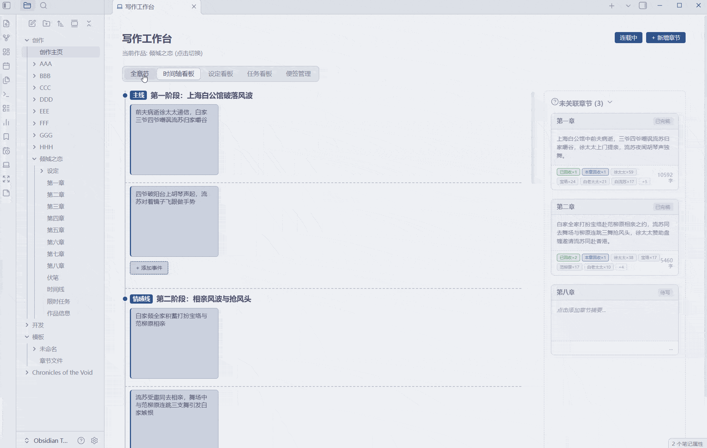

### 🌑 沉浸写作模式
<sub>全屏专注 · 打字机居中滚动与行淡化 · 动态仪表盘 · 插槽化布局</sub>

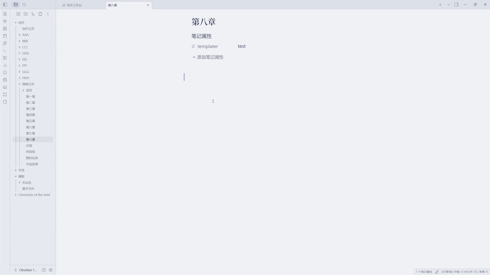

### 📊 字数统计与目标追踪
<sub>3种字数统计模式 · 多向目标追踪 · 严格章节模式 · 选区字数提示 · 章节排除统计 · 文件夹字数显示</sub>

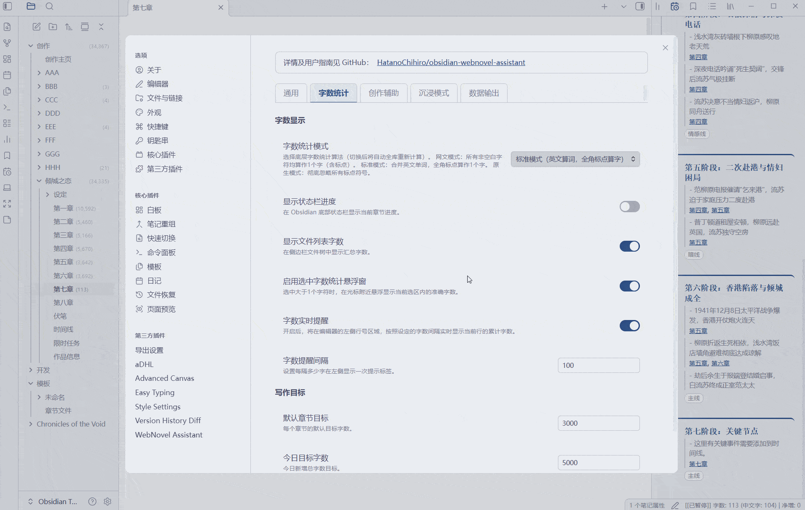

### ⏱️ 专注时间追踪
<sub>自动区分专注与摸鱼 · Worker线程 · 365热力图 · 柱状+趋势 · 效率卡片</sub>


### 🔍 校对
<sub>完全本地的编辑器内联检查 · 错词与敏感词 · 近义词一致性 · 中英文语境标点 · 可选“的/地/得”规则 · 建议卡片与确认后单处替换</sub>

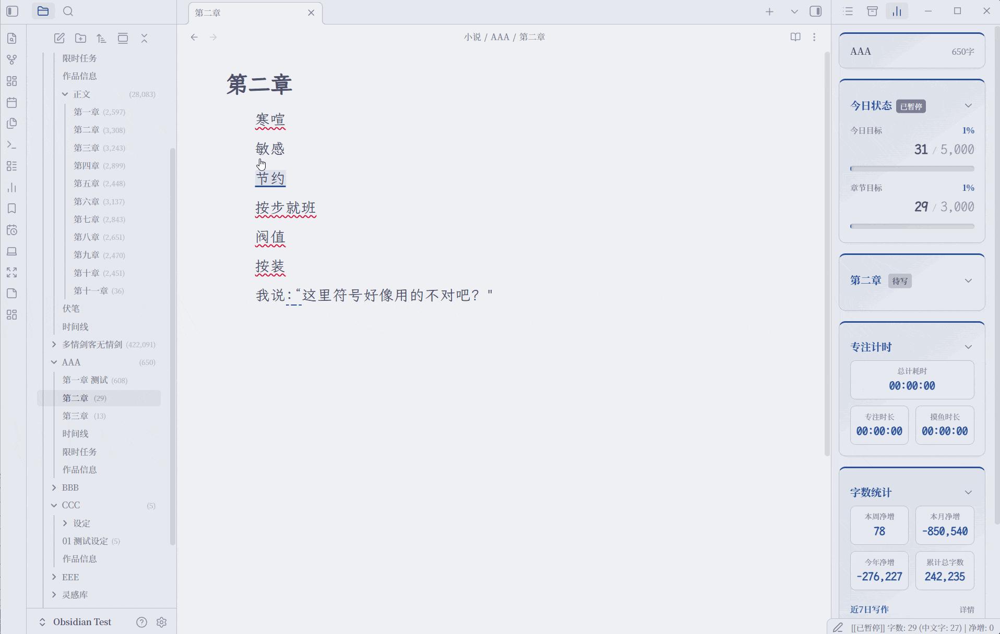

### 📝 创作辅助工具

<table>
<tr>
<td width="33%" align="center" valign="top">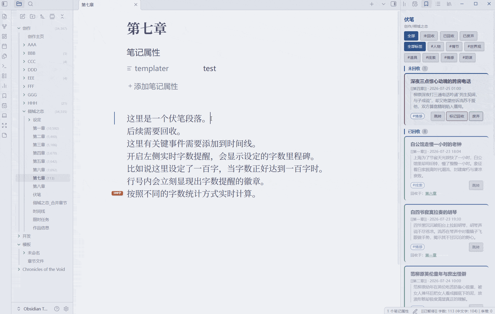<br /><b>伏笔管理</b><br /><sub>标注 → 阶段推进 → 彻底回收</sub></td>
<td width="33%" align="center" valign="top">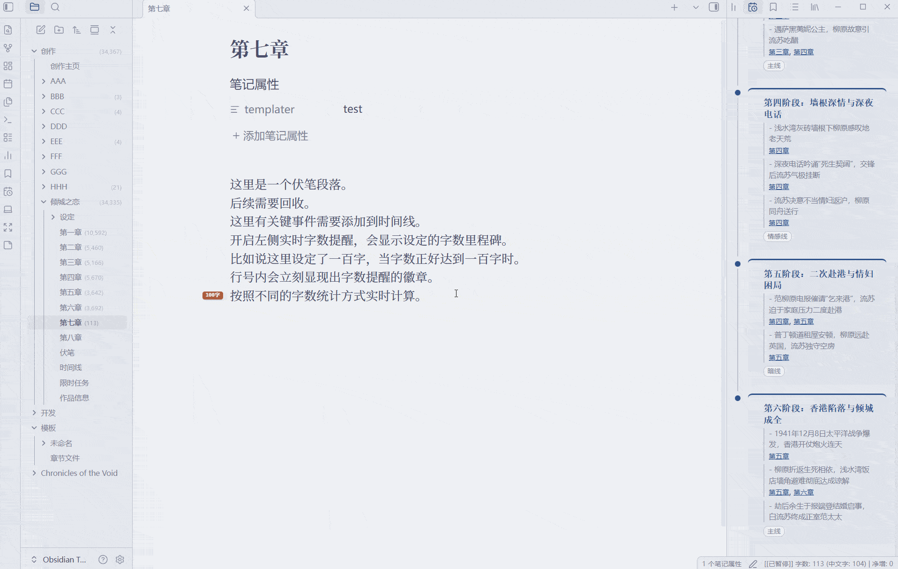<br /><b>时间线系统</b><br /><sub>事件记录、多章节关联、类型分类</sub></td>
<td width="33%" align="center" valign="top"><br /><b>章节一览</b><br /><sub>卡片式展示、状态标记、摘要编辑</sub></td>
</tr>
<tr>
<td width="33%" align="center" valign="top">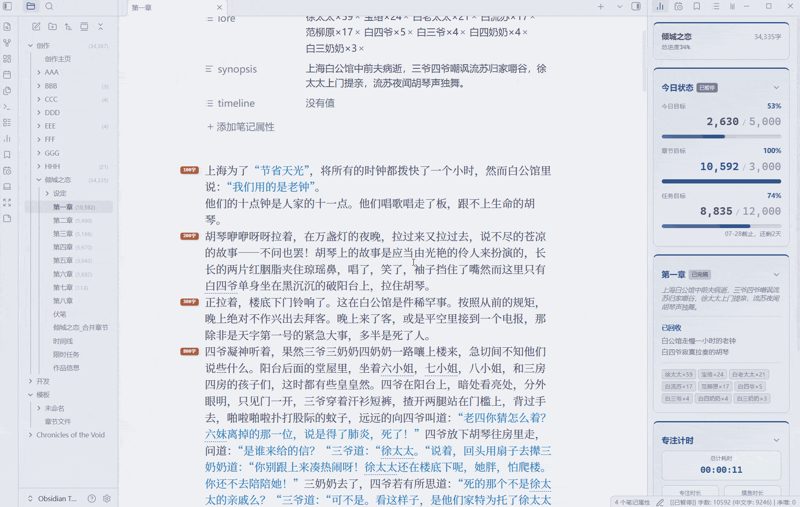<br /><b>设定速查与图谱</b><br /><sub>嵌套目录、单文件词条、自动标注与关系图谱</sub></td>
<td width="33%" align="center" valign="top">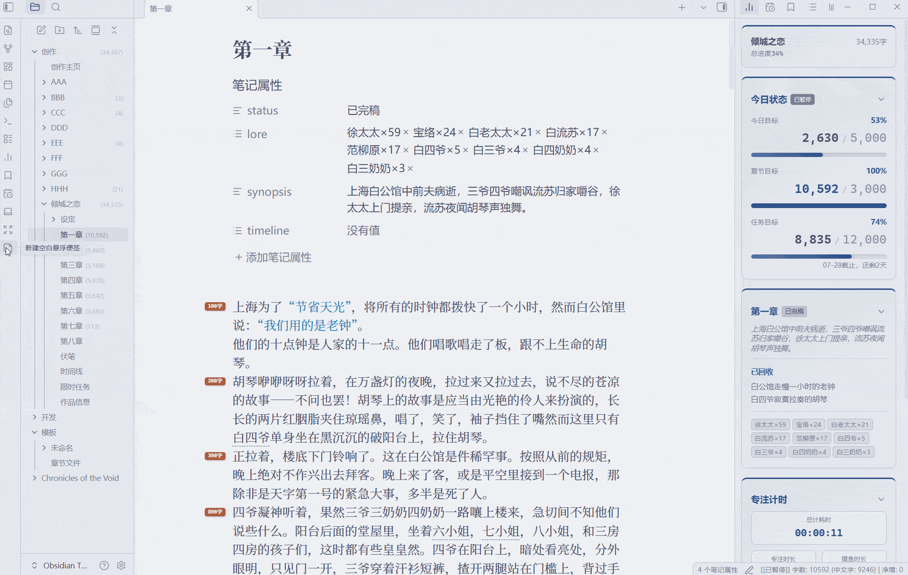<br /><b>悬浮便签</b><br /><sub>自动保存、Markdown渲染</sub></td>
<td width="33%" align="center" valign="top">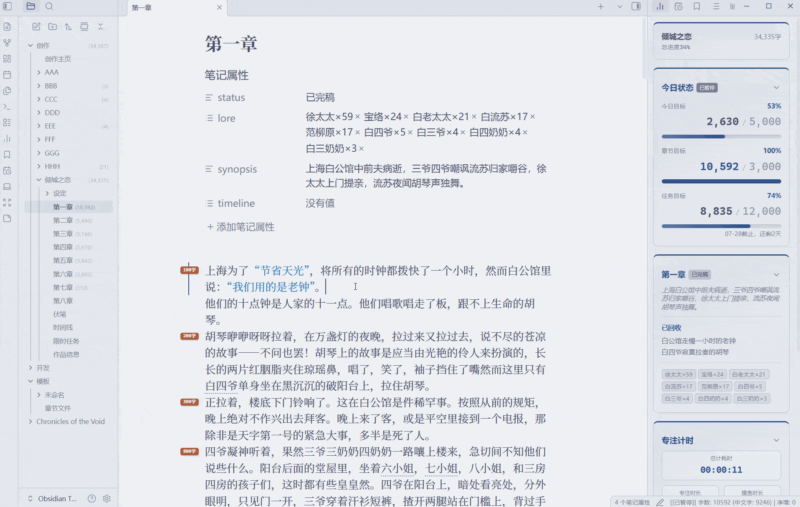<br /><b>任务追踪</b><br /><sub>创建周期任务、支持自主放弃</sub></td>
</tr>
<tr>
<td width="33%" align="center" valign="top"><br /><b>高级搜索</b><br /><sub>支持当前书籍、全局、自定义，快速跳转</sub></td>
<td width="33%" align="center" valign="top">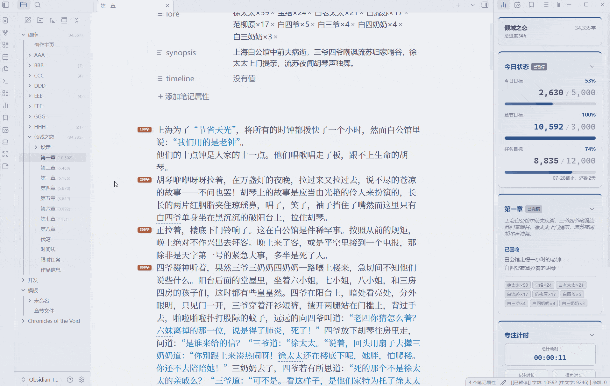<br /><b>合并章节</b><br /><sub>桌面预览修订 · 移动端预览导出</sub></td>
<td width="33%" align="center" valign="top">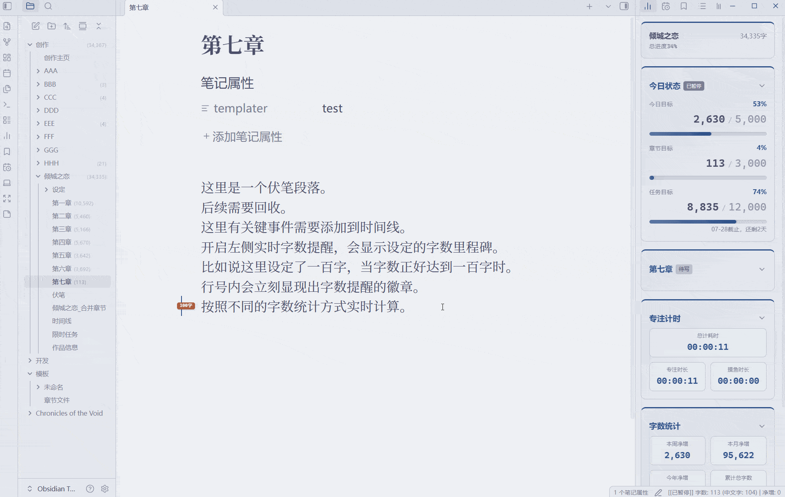<br /><b>自动创建下一章</b><br /><sub>自动创建带标号文档，支持模板</sub></td>
</tr>
</table>

### 🎥 OBS直播叠加层 & 📱 移动端

| 🎥 OBS叠加层 | 📱 移动端 |
|:---|:---|
| 实时显示写作数据 | 浮动字数统计与专注计时小窗 |
| 自定义样式、透明度、内容 | 贴边吸附与自动收起手柄模式 |
| 零延迟、零磁盘消耗 | **复制本文档纯净文本** — 一键带标题提取纯净正文 |

<br />

## 📥 安装

| 方式 | 步骤 |
|:-----|:-----|
| **社区插件市场** *(推荐)* | 设置 → 第三方插件 → 浏览 → 搜索 **"WebNovel Assistant"** → 安装 → 启用 |
| **BRAT** | 安装 [BRAT](https://github.com/TfTHacker/obsidian42-brat) → 添加仓库 `undustcover/obsidian_webnovel_pro` → 启用 |
| **手动安装** | [下载](https://github.com/undustcover/obsidian_webnovel_pro/releases) → 解压到 `.obsidian/plugins/web-novel-assistant/` → 重启启用 |

## 🚀 快速开始

### 普通用户：安装后直接使用

使用社区插件市场、BRAT 或 Release 手动安装时，**不需要安装 Node.js 或任何依赖**。

1. 在 Obsidian 中启用 **WebNovel Assistant**，打开或创建一个 Vault。
2. 打开任意 Markdown 文件，状态栏会显示实时字数；点击字数可设置目标。
3. 按 `Ctrl/Cmd+P` 打开命令面板，搜索 `WebNovel` 使用工作台、时间线、伏笔、沉浸写作等功能。
4. 桌面端可运行 **打开小说控制台**。如果“小说控制台项目映射”保持空数组，插件会从现有“工作区文件夹”自动派生项目；修改显式映射后需重载 Obsidian。
5. 在 **设置 → WebNovel Assistant** 中配置章节规则、目标、目录和其他功能。

### 开发者：从源码快速启动

#### 环境依赖

- [Node.js 20 LTS](https://nodejs.org/)（与发布流水线一致，安装时会自带 npm）
- npm 10 或更高版本
- Obsidian 1.8.7 或更高版本
- Git（仅克隆仓库时需要）

本项目以 `package-lock.json` 为依赖锁文件，推荐使用 npm。普通开发不要混用 pnpm、Yarn 与 npm，以免生成不同的依赖树。

最快的本地加载方式，是直接把源码克隆到测试 Vault 的插件目录：

```bash
cd <你的-Vault>/.obsidian/plugins
git clone https://github.com/undustcover/obsidian_webnovel_pro.git web-novel-assistant
cd web-novel-assistant
npm ci
npm run dev
```

`npm ci` 会严格按锁文件安装开发依赖；`npm run dev` 会同时监听 TypeScript 和 CSS，并生成 Obsidian 实际加载的 `main.js` 与 `styles.css`。保持该终端运行，然后：

1. 打开 Obsidian 的 **设置 → 第三方插件**。
2. 关闭安全模式，并启用 **WebNovel Assistant**。
3. 插件已启用时，在代码重新构建后重载 Obsidian，或先关闭再重新启用插件。

如果源码不在 Vault 内，也可以执行 `npm ci && npm run build`，然后把以下三个文件复制到 `<Vault>/.obsidian/plugins/web-novel-assistant/`：

```text
main.js
manifest.json
styles.css
```

注意目录不能多嵌套一层；`manifest.json` 必须直接位于 `web-novel-assistant` 文件夹中。

复制后可执行只读校验（脚本不会覆盖或删除 Vault 文件）：

```bash
npm run verify:artifact -- --build . --installed "<你的-Vault>/.obsidian/plugins/web-novel-assistant"
```

退出码 `0` 表示版本、必需文件和 SHA-256 全部一致；`2` 表示缺少文件；`3` 表示文件 hash 或版本不一致。不要把 `node_modules`、`.git`、`src`、`tests` 或 `coverage` 当作发布包复制到 Vault。

#### 常用开发命令

| 命令 | 用途 |
|---|---|
| `npm ci` | 按锁文件进行干净、可复现的依赖安装 |
| `npm run dev` | 同时监听 JS 与 CSS，适合本地开发 |
| `npm run build` | 类型检查、lint 后生成压缩的发布构建 |
| `npm run type-check` | 仅运行 TypeScript 检查 |
| `npm run lint` | CSS、ESLint、Obsidian API 和 i18n 审计 |
| `npm test` | 运行完整测试套件 |
| `npm run test:coverage` | 运行测试并检查覆盖率门槛 |
| `npm run benchmark:console` | 物化临时 10k Vault 并运行控制台性能基准；结束后自动清理 |

#### 依赖安装故障排查

- 提示 `npm` 或 `node` 不存在：安装 Node.js 20 LTS 后重新打开终端，运行 `node --version` 和 `npm --version` 确认。
- Windows PowerShell 阻止执行 `npm.ps1`：改用 `npm.cmd ci`、`npm.cmd run dev`，或使用命令提示符。
- 出现 `Cannot find module`：确认当前目录包含 `package.json`，然后重新运行 `npm ci`。
- pnpm 提示未批准 `esbuild` 安装脚本：切换回本项目锁定的 npm 流程并运行 `npm ci`。
- Obsidian 找不到插件：确认目录是 `.obsidian/plugins/web-novel-assistant/`，且其中直接包含 `main.js`、`manifest.json`、`styles.css`，随后重载 Obsidian。

<details>
<summary><kbd>🎯 主要命令</kbd></summary>

| 命令 | 说明 |
|------|------|
| 进入/退出 沉浸写作模式 | 切换全屏沉浸创作环境 |
| 打开/关闭写作实时状态面板 | 详细统计和历史图表 |
| 打开/关闭伏笔面板 | 管理伏笔标注和回收 |
| 打开/关闭时间线面板 | 管理故事时间线 |
| 打开写作工作台面板 | 管理章节、时间线、设定、任务和便签看板 |
| 打开章节一览 | 卡片式展示章节纲要 |
| 开始/暂停 专注时间统计 | 切换专注/摸鱼计时 |
| 标注为伏笔 | 将选中文字标注为伏笔 |
| 新建空白悬浮便签 | 创建浮动便签 |
| 高级搜索 | 搜索书籍/全局/自定义范围 |
| 自动创建下一章 (智能递增) | 智能递增章节编号 |
| 重建设定缓存 | 重建设定条目和章节设定引用统计 |
| 标注为词库 | 将任意 Markdown 文档中的选中文字录入自定义词典 |

> 所有命令可在 **设置 → 快捷键** 中自定义

> 详细设置与故障排查请参阅完整[使用指南](doc/USER_GUIDE.md) / [User Guide](doc/USER_GUIDE_EN.md)。

</details>

<details>
<summary><kbd>⚙️ 主要设置</kbd></summary>

| 设置 | 默认值 | 说明 |
|------|--------|------|
| 语言 | 跟随系统 | 界面语言，首次安装自动检测 |
| 默认章节目标 | 3000 | 新文件的默认章节目标 |
| 今日目标字数 | 5000 | 今日写作目标 |
| 显示文件列表字数 | 关闭 | 大型项目建议关闭 |
| 智能章节排序 | 关闭 | 自动按章节编号排序 |
| 护眼模式 | 关闭 | 编辑器背景护眼色 |
| 沉浸便签尺寸 | 280px | 沉浸模式下便签卡片边长 |
| 伏笔文件名 | `伏笔` | 可按工作区自定义 |
| 时间线文件名 | `时间线` | 可按工作区自定义 |
| 限时任务文件名 | `限时任务` | 可按工作区自定义 |
| 设定文件夹名称 | `设定` | 支持字典大纲模式 |
| 字数统计模式 | 标准模式 | 标准/网文/原生 统计算法 |

</details>

<details>
<summary><kbd>🎨 OBS叠加层设置</kbd></summary>

1. 插件设置 → 启用 **OBS叠加层**
2. OBS → 添加 **浏览器源** → URL `http://127.0.0.1:24816/`
3. 建议 **300×500px**

详见 [OBS叠加层CSS指南](doc/OBS_OVERLAY_CSS_GUIDE.md)

</details>

<br />

## 🌐 联网行为说明

校对扫描及全部笔记分析均在本地完成，插件无自动联网请求。基础错词库与“的/地/得”规则词典未内置打包，首次使用需在设置中手动下载。只有用户主动点击 **更新基本错词库** 或 **更新规则词典** 时，才会通过 Obsidian 的 `requestUrl` API 从 `raw.githubusercontent.com/HatanoChihiro/obsidian-webnovel-assistant` 下载公开 JSON 词典；绝不上传正文、仓库路径、设备标识、账户数据或遥测信息。下载内容只会按纯词典数据严格校验并缓存，不允许包含远程正则或脚本，不会作为代码执行，也不会用于更新插件本身或依赖。

<br />

<div align="center">

## 📄 许可证 & 💬 反馈

[MIT License](LICENSE)

作者：**undustcover** · ⭐ Star · 🐛 [提交问题](https://github.com/undustcover/obsidian_webnovel_pro/issues) · 💡 [功能建议与讨论](https://github.com/undustcover/obsidian_webnovel_pro/discussions)

<br />

**祝你写作愉快！** ✍️

</div>

---

<a id="english"></a>

<div align="center">

# ✍️ WebNovel Assistant

**English** | **[中文](#中文)**

[](https://github.com/undustcover/obsidian_webnovel_pro/releases)
[](LICENSE)
[](https://obsidian.md/plugins?id=web-novel-assistant)

An all-in-one writing studio for novel and story writers in Obsidian.<br />
Novel Console & safe story planning · Accurate word counts and goals · Timelines · Foreshadowing · Chapter boards · Lore graphs · Focused writing.

<br />

<a href="doc/USER_GUIDE_EN.md"><kbd>📖 v0.3 Manual / User Guide</kbd></a>
<a href="doc/RELEASE_NOTES_v0.3.md"><kbd>🚀 v0.3 Release Notes</kbd></a>
<a href="doc/OBS_OVERLAY_CSS_GUIDE_EN.md"><kbd>🎥 OBS CSS Guide</kbd></a>
<a href="doc/CHANGELOG.md"><kbd>📋 Changelog</kbd></a>

<br />

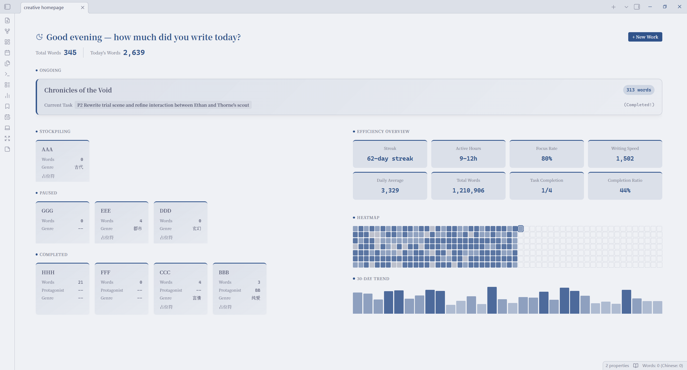

</div>

<br />

## ✨ Feature Highlights

### 🧭 Novel Console v0.3 (Desktop)
<sub>Unified overview · Five-level narrative navigation · Manuscript/event/milestone/task management · Multiple timelines · Context generation · Data health checks</sub>

The Novel Console treats Markdown as the sole source of truth and builds a read-only index from both the new schema and existing chapters, timelines, foreshadowing notes, lore, and timed tasks. High-risk changes show a change plan and impact report before confirmation, and initial indexing never bulk-rewrites notes. The Console entry is desktop-only; existing mobile features remain available.

Version policy: **v0.3 is the current public release; its plugin manifest version is 0.3.0 (Git tag v0.3)**. It delivers the Novel Console V0.21 feature specification in full. Runtime versioning remains authoritative in `manifest.json`, with Obsidian 1.8.7 as the minimum supported version.

#### New interfaces and capabilities in v0.3

- **Project and index status**: first-run setup, project switching, index health, error causes, retry, and rebuild actions live together in the Console header.
- **Overview and navigation**: dedicated Novel Overview, Changes, ID Registry, Templates, and five-level narrative pages for book, volume, stage, chapter plan, and chapter.
- **Entity centers**: separate manuscript, character, organization, location, and item views with adjacent Markdown navigation. Canonical lore uses category folders and one Markdown file per entity.
- **Creative control**: reachable workflows for event creation/state, timeline projections, unique focus, multi-storyline cursors, milestones, current tasks, suggestions, and foreshadowing anchors.
- **Safe writes**: important operations preview file changes, field diffs, risks, and impact before confirmation; cancel performs zero writes, while failures compensate or provide recovery steps.
- **Context and health**: preview and publish Markdown/JSON context, and diagnose duplicate IDs, invalid anchors, structure, continuity, and progression issues.
- **Compatibility and scale**: legacy chapters, timelines, foreshadowing, lore collections, and timed tasks remain readable; incremental indexing supports 10k-note vaults without full rescans on normal edits.

### 🏠 Creative Homepage
<sub>Full-width Dashboard · Dynamic Welcome · Novel Overview · Stats Panel · One-Click New Novel & Import Novel</sub>

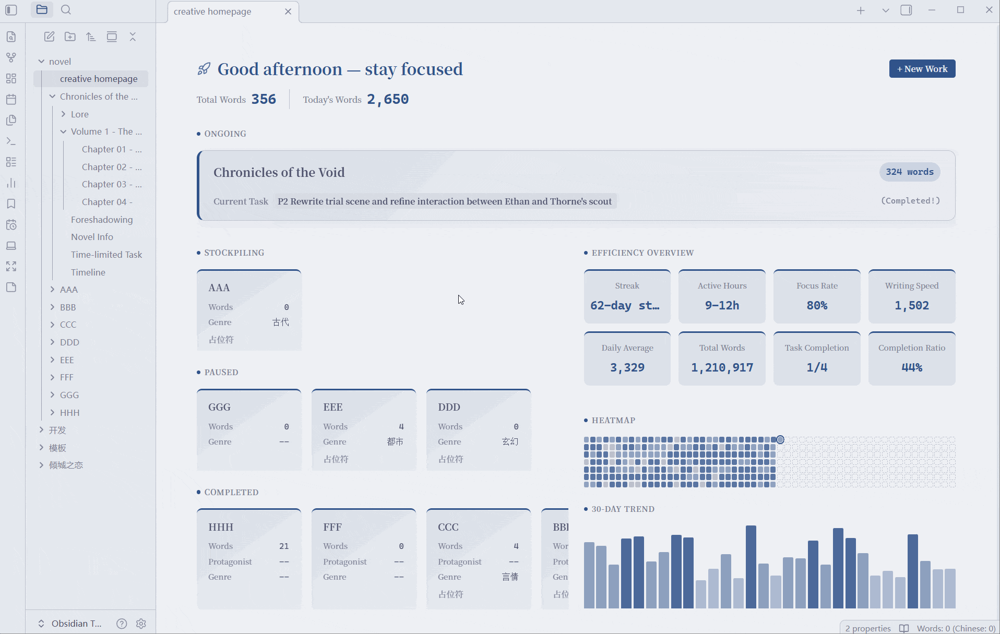

### 🗂️ Writing Workbench
<sub>All Chapters Panel · Timeline Board · Foreshadowing Board · Lore Board · Task Board · Writing Journey</sub>

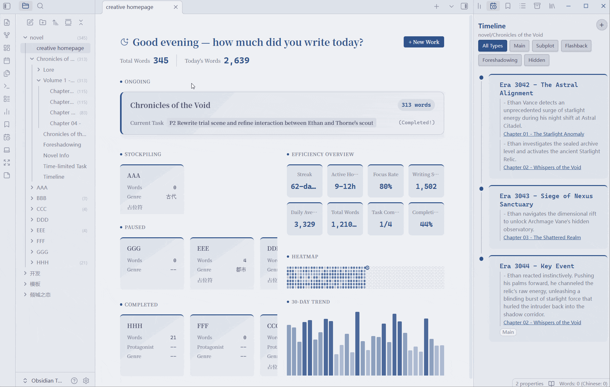

### 🌑 Immersive Writing Mode
<sub>Full-screen Focus · Typewriter Scroll & Line Dimming · Dynamic Dashboard · Slot-based Layout</sub>

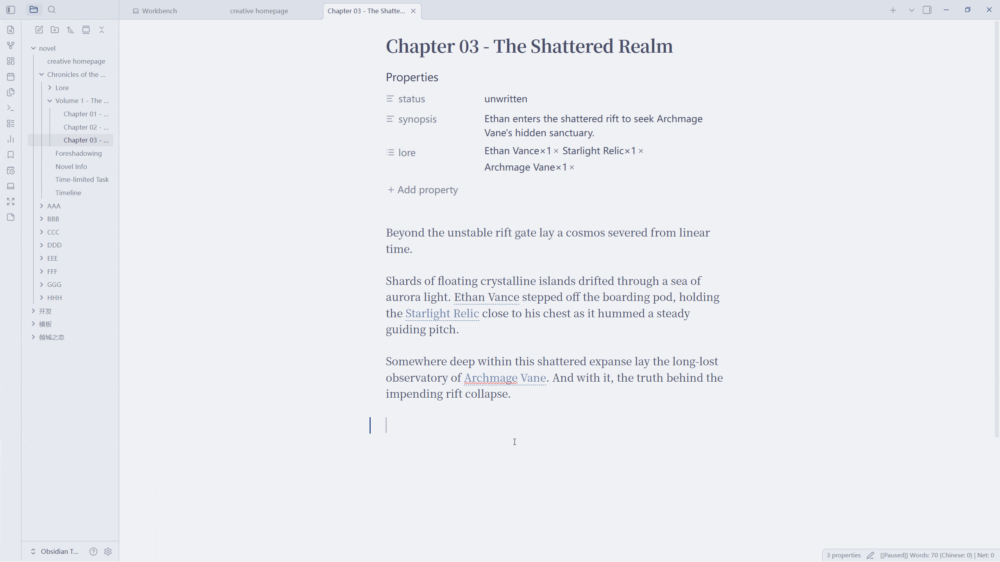

### 📊 Word Count & Goals
<sub>3 Counting Modes · Multi-direction Goal Tracking · Strict Chapter Mode · Selection Count Tooltip · Chapter Exclusion · Folder Word Counts</sub>

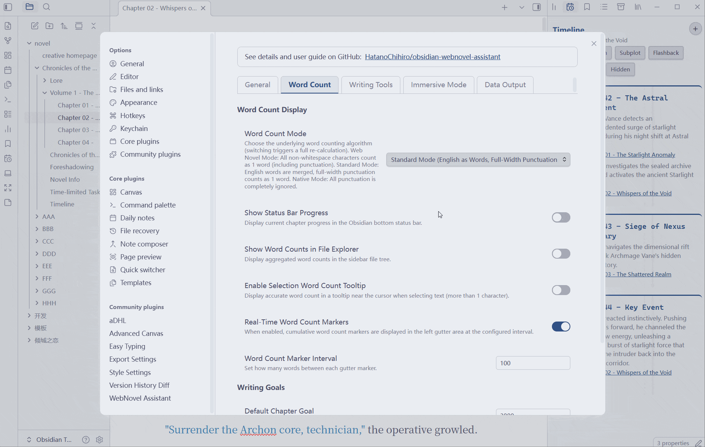

### ⏱️ Focus Time Tracking
<sub>Auto focus vs. slack detection · Web Worker · 365 Heatmap · Bar+line trend · Efficiency card</sub>

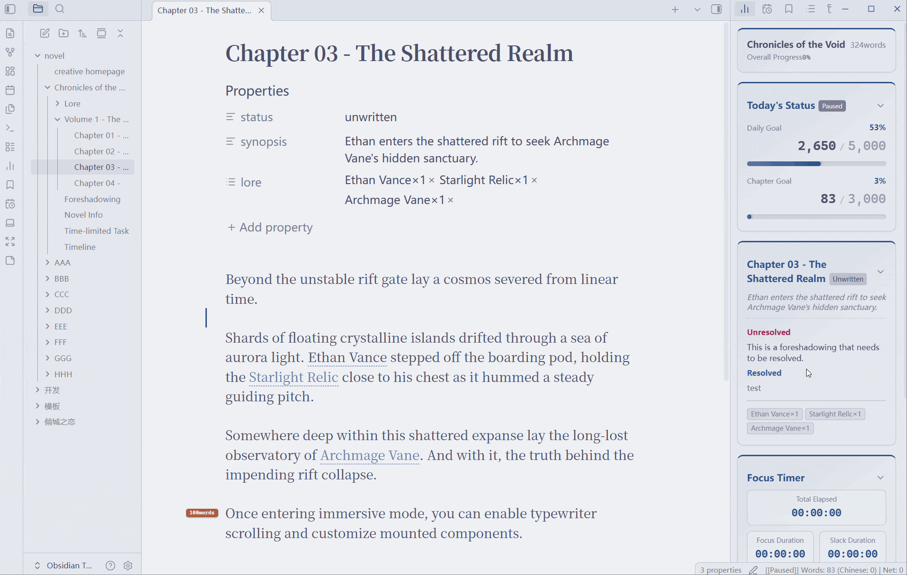

### 🔍 Proofreading
<sub>Fully local inline diagnostics · Typos & sensitive words · Synonym consistency · Text-aware Chinese/English punctuation · Optional De/Di/De rules · Review cards & confirmed one-at-a-time replacement</sub>

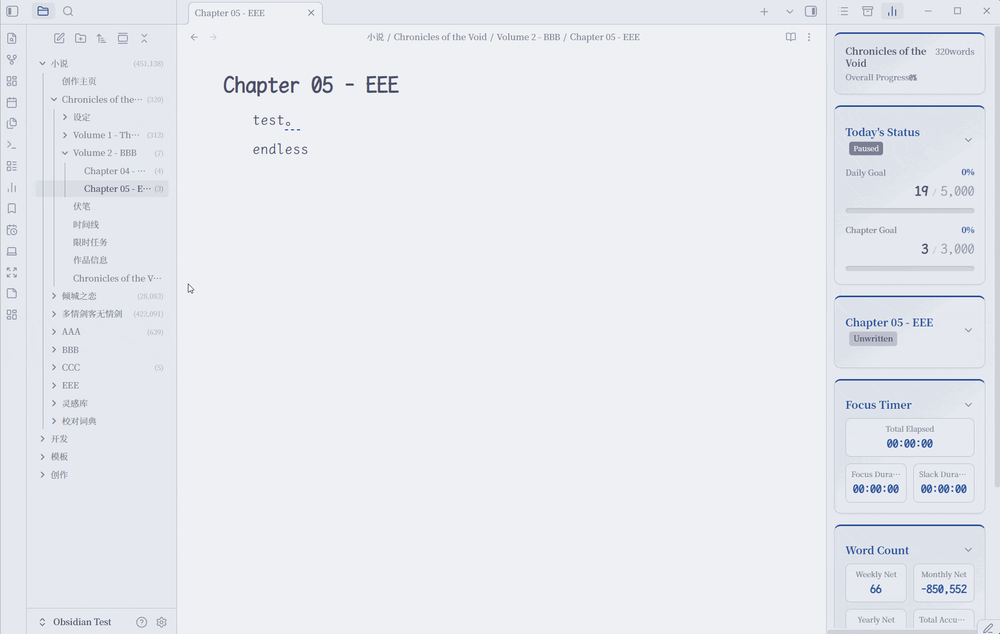

### 📝 Creative Assistants

<table>
<tr>
<td width="33%" align="center" valign="top">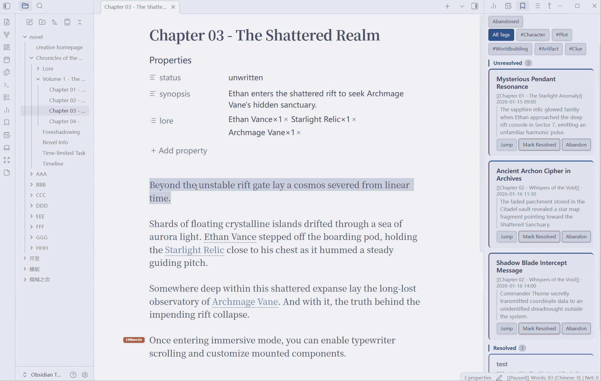<br /><b>Foreshadowing Manager</b><br /><sub>Mark → Multi-stage tracking → Final resolution</sub></td>
<td width="33%" align="center" valign="top">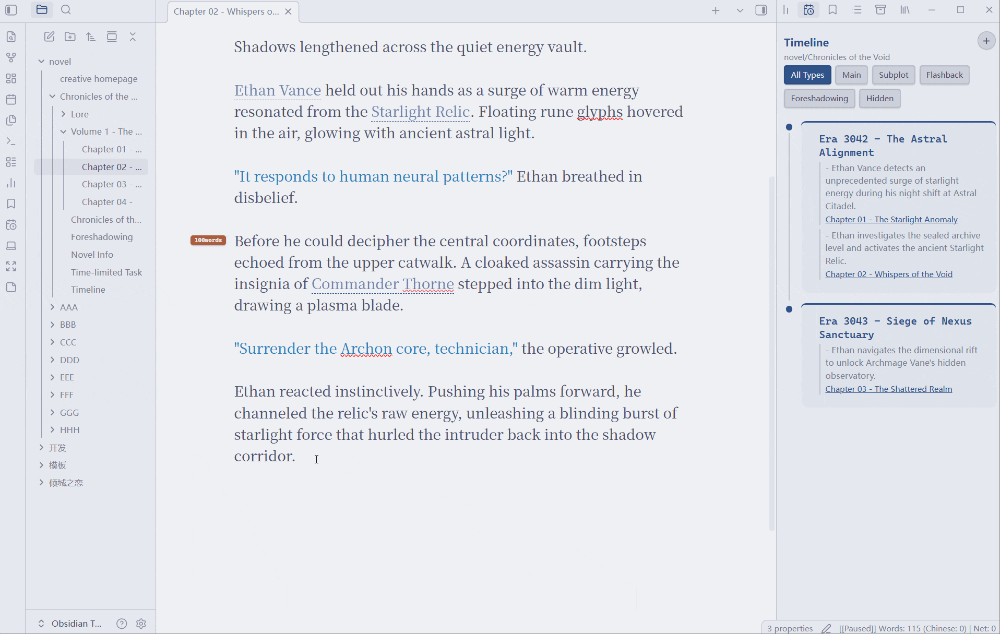<br /><b>Timeline System</b><br /><sub>Events, multi-chapter links, custom types</sub></td>
<td width="33%" align="center" valign="top">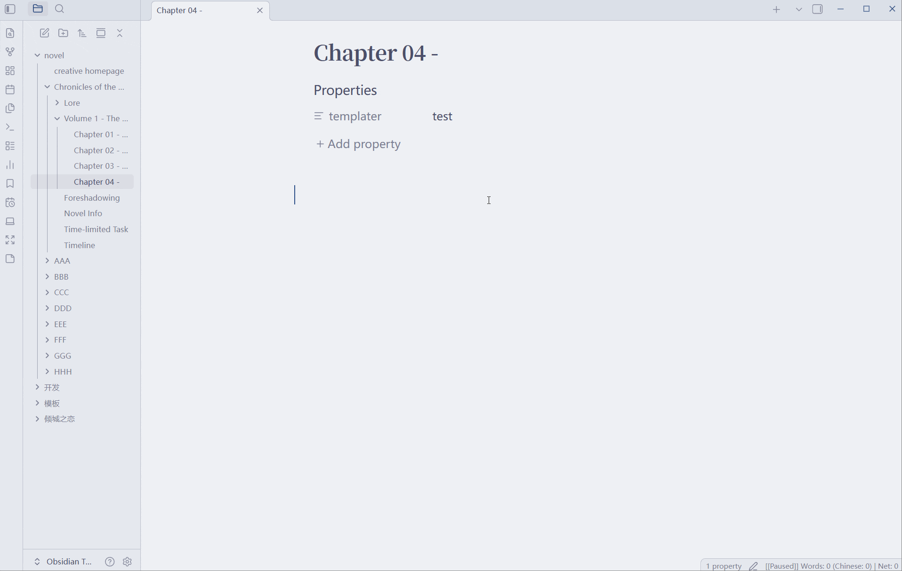<br /><b>Chapter Corkboard</b><br /><sub>Card overview, status & synopsis editing</sub></td>
</tr>
<tr>
<td width="33%" align="center" valign="top">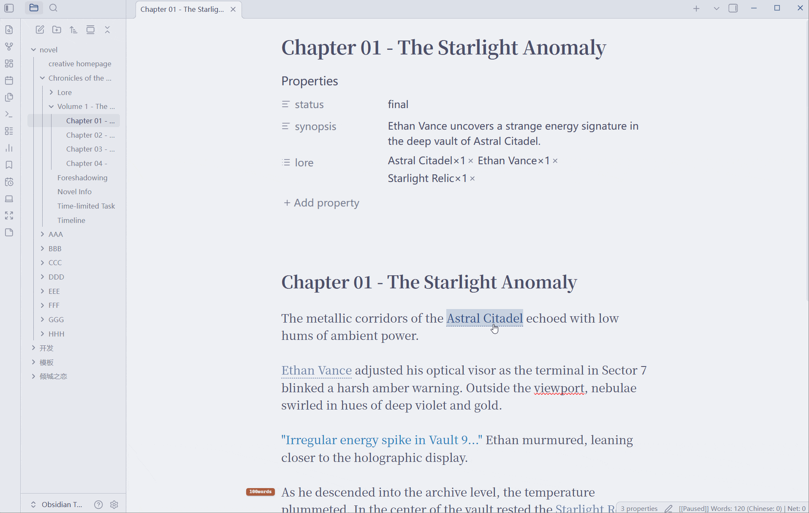<br /><b>Lore Quick Lookup</b><br /><sub>Nested folders, file entries, auto-highlights & relation graph</sub></td>
<td width="33%" align="center" valign="top">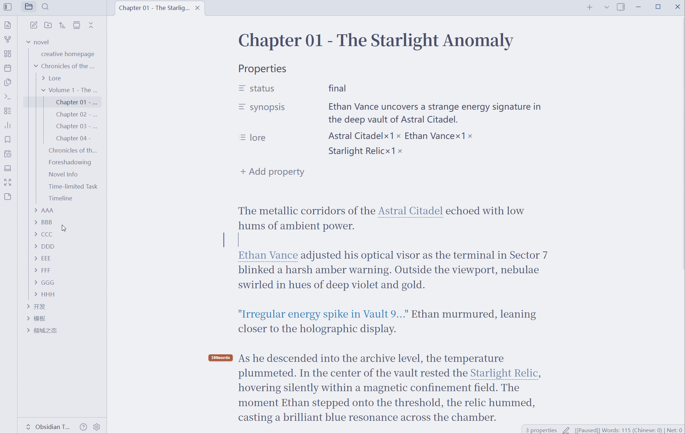<br /><b>Sticky Notes</b><br /><sub>Auto-save, Markdown render</sub></td>
<td width="33%" align="center" valign="top">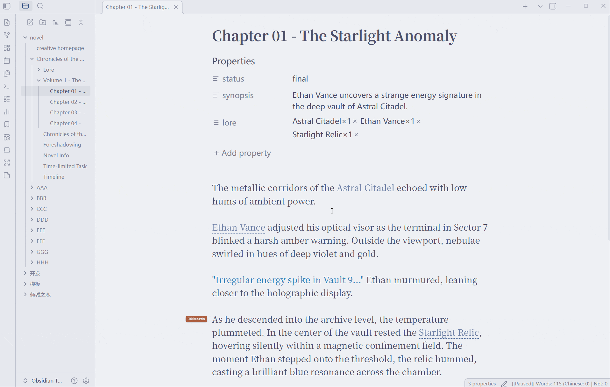<br /><b>Task Tracker</b><br /><sub>Create periodic tasks, self-driven deadlines & voluntary abandon</sub></td>
</tr>
<tr>
<td width="33%" align="center" valign="top"><br /><b>Advanced Search</b><br /><sub>Search by book, global or custom scope</sub></td>
<td width="33%" align="center" valign="top">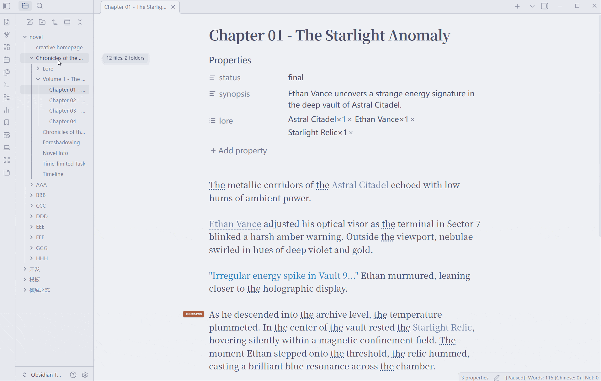<br /><b>Merge Chapters</b><br /><sub>Desktop preview & revision · Mobile preview & export</sub></td>
<td width="33%" align="center" valign="top">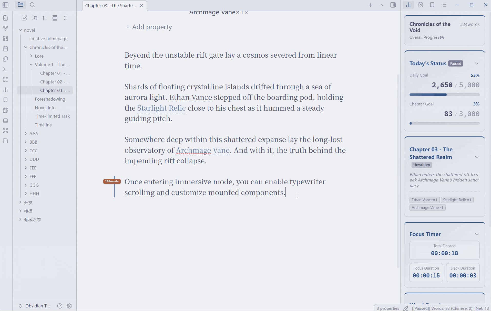<br /><b>Auto-Create Next Chapter</b><br /><sub>Auto-create numbered documents, template support</sub></td>
</tr>
</table>

### 🎥 OBS Streaming Overlay & 📱 Mobile

| 🎥 OBS Overlay | 📱 Mobile |
|:---|:---|
| Real-time writing stats in OBS | Floating word count & focus timer widget |
| Custom style, opacity & content | Edge docking & auto-collapse handle |
| Zero latency, zero disk I/O | **Copy Document** — one-click with title prepended |

<br />

## 📥 Installation

| Method | Steps |
|:-------|:------|
| **Community Plugins** *(Recommended)* | Settings → Community Plugins → Browse → Search **"WebNovel Assistant"** → Install → Enable |
| **BRAT** | Install [BRAT](https://github.com/TfTHacker/obsidian42-brat) → Add repo `undustcover/obsidian_webnovel_pro` → Enable |
| **Manual** | [Download](https://github.com/undustcover/obsidian_webnovel_pro/releases) → Extract to `.obsidian/plugins/web-novel-assistant/` → Restart & Enable |

## 🚀 Quick Start

### Users: start immediately after installation

Community Plugins, BRAT, and release builds require **no Node.js installation or dependency setup**.

1. Enable **WebNovel Assistant** and open or create an Obsidian vault.
2. Open any Markdown file. The status bar shows the live word count; click it to set a goal.
3. Open the Command Palette with `Ctrl/Cmd+P`, then search for `WebNovel` to access the workbench, timeline, foreshadowing tools, and immersive writing mode.
4. On desktop, run **Open Novel Console**. An empty “Novel Console Project Mappings” array derives projects from the existing workspace folders; reload Obsidian after changing an explicit mapping.
5. Configure chapter rules, goals, folders, and other features under **Settings → WebNovel Assistant**.

### Developers: run from source

#### Prerequisites

- [Node.js 20 LTS](https://nodejs.org/) (matches the release workflow and includes npm)
- npm 10 or newer
- Obsidian 1.8.7 or newer
- Git, when cloning the repository

`package-lock.json` is the authoritative dependency lockfile. Use npm for normal development and avoid mixing pnpm, Yarn, and npm dependency trees.

The shortest local setup is to clone the repository directly into a test vault's plugin directory:

```bash
cd <your-vault>/.obsidian/plugins
git clone https://github.com/undustcover/obsidian_webnovel_pro.git web-novel-assistant
cd web-novel-assistant
npm ci
npm run dev
```

`npm ci` installs the exact locked development dependencies. `npm run dev` watches TypeScript and CSS and generates the `main.js` and `styles.css` files loaded by Obsidian. Keep the terminal running, then:

1. Open **Settings → Community plugins** in Obsidian.
2. Turn off Restricted mode and enable **WebNovel Assistant**.
3. After a rebuild, reload Obsidian or disable and re-enable the plugin.

If the source repository is outside the vault, run `npm ci && npm run build`, then copy these files into `<Vault>/.obsidian/plugins/web-novel-assistant/`:

```text
main.js
manifest.json
styles.css
```

Do not add another nested directory: `manifest.json` must be directly inside the `web-novel-assistant` directory.

After copying, run the read-only verifier below. It never overwrites or deletes Vault files:

```bash
npm run verify:artifact -- --build . --installed "<your-Vault>/.obsidian/plugins/web-novel-assistant"
```

Exit code `0` means the version, required files, and SHA-256 hashes all match; `2` means a required file is missing; `3` means a hash or version differs. Do not copy `node_modules`, `.git`, `src`, `tests`, or `coverage` as part of a release package.

#### Development commands

| Command | Purpose |
|---|---|
| `npm ci` | Install dependencies reproducibly from the lockfile |
| `npm run dev` | Watch JS and CSS during local development |
| `npm run build` | Type-check, lint, and create a minified release build |
| `npm run type-check` | Run TypeScript checks only |
| `npm run lint` | Run CSS, ESLint, Obsidian API, and i18n audits |
| `npm test` | Run the complete test suite |
| `npm run test:coverage` | Run tests and enforce coverage thresholds |
| `npm run benchmark:console` | Materialize a temporary 10k vault, run the Console benchmark, and clean it up |

#### Dependency troubleshooting

- `npm` or `node` is not found: install Node.js 20 LTS, reopen the terminal, and verify with `node --version` and `npm --version`.
- PowerShell blocks `npm.ps1`: use `npm.cmd ci` and `npm.cmd run dev`, or use Command Prompt.
- `Cannot find module`: make sure the current directory contains `package.json`, then run `npm ci` again.
- pnpm asks for approval to run the `esbuild` install script: return to the npm workflow used by this repository and run `npm ci`.
- Obsidian cannot find the plugin: verify that `.obsidian/plugins/web-novel-assistant/` directly contains `main.js`, `manifest.json`, and `styles.css`, then reload Obsidian.

<details>
<summary><kbd>🎯 Key Commands</kbd></summary>

| Command | Description |
|---------|-------------|
| Toggle Immersive Writing Mode | Full-screen distraction-free writing |
| Toggle Writing Status Panel | Detailed stats & history charts |
| Toggle Foreshadowing Panel | Manage foreshadowing & recovery |
| Toggle Timeline Panel | Manage story timeline |
| Toggle Writing Workbench View | Chapters, timeline, lore, task and notes boards |
| Open Chapter Overview | Card-style chapter overview |
| Start/Pause Focus Time Tracking | Toggle focus/slack tracking |
| Mark as Foreshadowing | Mark selected text as foreshadowing |
| Create Blank Sticky Note | New floating sticky note |
| Advanced Search | Search by book/global/custom scope |
| Create Next Chapter (Smart Increment) | Smart chapter numbering |
| Rebuild Lore Cache | Rebuild lore entries and chapter reference statistics |
| Annotate to Dictionary | Add selected text from any Markdown document to a custom dictionary |

> All commands can get custom shortcuts in **Settings → Hotkeys**

> Need setup details or troubleshooting? See the full [User Guide](doc/USER_GUIDE_EN.md) / [使用指南](doc/USER_GUIDE.md).

</details>

<details>
<summary><kbd>⚙️ Key Settings</kbd></summary>

| Setting | Default | Description |
|---------|---------|-------------|
| Language | Auto | UI language — auto-detects Obsidian locale |
| Default Chapter Goal | 3000 | Chapter word goal for new files |
| Daily Goal | 5000 | Daily writing target |
| Show Word Counts in File Explorer | Off | Folder word counts in sidebar |
| Smart Chapter Sorting | Off | Auto-sort by chapter numbers |
| Eye Care Mode | Off | Warm background color |
| Immersive Note Size | 280px | Sticky note card size in immersive mode |
| Foreshadowing Filename | `Foreshadowing` | Customizable per workspace |
| Timeline Filename | `Timeline` | Customizable per workspace |
| Timed Task Filename | `Timed Task` | Customizable per workspace |
| Lore Folder Name | `Lore` | Supports dictionary outline mode |
| Word Count Mode | Standard | Standard / Web Novel / Native algorithm |

</details>

<details>
<summary><kbd>🎨 OBS Overlay Setup</kbd></summary>

1. Plugin settings → Enable **OBS Overlay**
2. OBS → Add **Browser Source** → URL `http://127.0.0.1:24816/`
3. Recommended: **300×500px**

See [OBS Overlay CSS Guide](doc/OBS_OVERLAY_CSS_GUIDE_EN.md) for full customization.

</details>

<br />

## 🌐 Network Use Disclosure

Proofreading and all note analysis run entirely locally. The plugin makes no automatic network requests. The basic typo dictionary and De/Di/De grammar dictionary are not bundled and require manual download in Settings on first use. Only when you explicitly click **Update Basic Dictionary** or **Update Grammar Dictionary** does it use Obsidian's `requestUrl` API to download public JSON dictionaries from `raw.githubusercontent.com/HatanoChihiro/obsidian-webnovel-assistant`. No note content, vault path, device identifier, account data, or telemetry is uploaded. Responses are strictly validated as dictionary data, cached as JSON, and never executed as code or used to update the plugin or its dependencies.

<br />

<div align="center">

## 📄 License & 💬 Feedback

[MIT License](LICENSE)

Author: **undustcover** · ⭐ Star · 🐛 [Issues](https://github.com/undustcover/obsidian_webnovel_pro/issues) · 💡 [Discussions & Feature Requests](https://github.com/undustcover/obsidian_webnovel_pro/discussions)

<br />

**Happy writing!** ✍️

</div>
